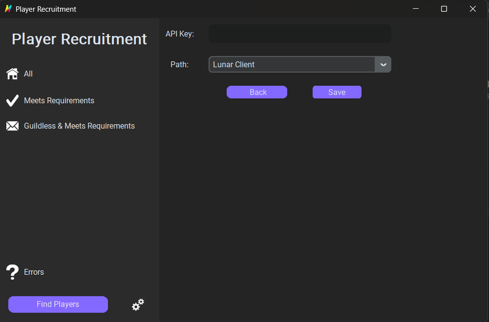

# PlayerRecruiter

An open-source application that helps Hypixel guilds recruit players from lobbies!  
This script goes through your Minecraft chat logs and checks users' stats to see if they are eligible to join your guild. You can set your own requirements inside the application!

# Usage
1. Download zip file by visiting [GitHub Releases][releases].
2. After downloading, unzip the file in any place you desire.
3. Open the folder and look for _Recruiter.exe_.
4. Open _Recruiter.exe_.
5. You will be asked to enter your API Key and then choose your Minecraft client.

To get an API Key, visit [this link][APIKEY] and copy-paste your _Developer Key_. This API Key resets every three days; if you do not like that, you will have to navigate to the "Apps" tab and then hit "CREATE APP". After that, select "Personal API Key" and then follow the prompts (Not recommended).
6. After that, hit _Save_
1. After that, you will be asked to enter your guild's requirements. You can enter any number you want, but make sure to enter a number between 0 and 100.
2. After that, you're ready to go!

# Requirements
* A valid [API Key][APIKEY].
* One of the following clients:
  * Lunar Client (Default)
  * Badlion Client
  * Vanilla Minecraft
 

[APIKEY]:https://developer.hypixel.net/
[releases]:https://github.com/MiscGuild/PlayerRecruiter/releases/tag/v1
